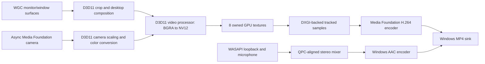

# ShareX.ScreenRecordingLib

A Windows 11 recording library for H.264/AAC MP4 files. The native ShareX recording path uses this library by default. It captures a desktop region (including regions spanning monitors) or an HWND, records system audio and/or a microphone, optionally overlays a camera, and supports pause, resume, stop and fixed duration. It does not launch a process or load an external capture or codec library.

## Research and selection

The following choices are engineering conclusions from Microsoft's API contracts, rather than universal performance rankings. Actual capture and encoding latency depend on the Windows compositor, GPU, driver, display topology and recording dimensions.

| Video capture option | Performance and latency considerations | Compatibility and limitations | Decision |
| --- | --- | --- | --- |
| Windows Graphics Capture (WGC) | Delivers D3D11 surfaces. Free-threaded frame pools avoid UI dispatcher work. Capture updates can be consumed without CPU image extraction. | Monitor and window targets; built-in cursor handling. Protected content, secure desktops and minimized windows remain subject to Windows restrictions. Requests borderless capture access to hide the system border. | Selected for a common screen/window implementation. |
| DXGI Desktop Duplication | GPU surfaces, dirty/move rectangles; attractive for monitor capture or remote desktop implementations that exploit changed regions. | Output-based; window capture requires cropping visible desktop pixels. Cursor composition, display rotation, access-loss recovery and output adapter selection require more work. | A viable future monitor backend; not a necessary fallback for the Windows 11 baseline. |
| GDI / DirectShow screen devices | CPU capture or an additional capture filter and format-transfer path. | GDI does not meet the GPU requirement; DirectShow screen filters are external components. | Excluded. |

Primary references: [WGC screen capture](https://learn.microsoft.com/en-us/windows/apps/develop/media-authoring-processing/screen-capture), [Win32 HWND capture](https://learn.microsoft.com/en-us/windows/win32/api/windows.graphics.capture.interop/nf-windows-graphics-capture-interop-igraphicscaptureiteminterop-createforwindow), [free-threaded frame pools](https://learn.microsoft.com/en-us/uwp/api/windows.graphics.capture.direct3d11captureframepool.createfreethreaded), and [Desktop Duplication](https://learn.microsoft.com/en-us/windows/win32/direct3ddxgi/desktop-dup-api).

| Audio option | Tradeoff | Decision |
| --- | --- | --- |
| WASAPI shared-mode event-driven capture | Endpoint loopback provides the render mix without an installed loopback device. Capture endpoints provide microphones. Packet QPC positions allow alignment with video. Windows can resample and map channels. | Selected. IAudioClient3's minimum shared period is attempted for microphones compatible with the requested format; a fresh client uses the default period and Windows resampling otherwise. Loopback uses the default shared period. |
| AudioGraph | Convenient processing graph, but its quantum synchronization adds buffering and offers less direct control over packet timing. | Unnecessary abstraction for a recorder with its own common timeline and mixer. |
| MediaCapture / Media Foundation capture sources | Useful for cameras and microphones, but do not replace endpoint loopback and desktop capture together. | Not selected as the capture layer. |
| Process loopback | Can include/exclude a process tree independently of an endpoint. Requires asynchronous activation and a separate selection model. | Useful future feature; this implementation captures the chosen render endpoint's complete mix. |

Primary references: [WASAPI](https://learn.microsoft.com/en-us/windows/win32/coreaudio/wasapi), [loopback recording](https://learn.microsoft.com/en-us/windows/win32/coreaudio/loopback-recording), [low-latency audio comparison](https://learn.microsoft.com/en-us/windows-hardware/drivers/audio/low-latency-audio), [Windows resampling flags](https://learn.microsoft.com/en-us/windows/win32/coreaudio/audclnt-streamflags-xxx-constants), and [process loopback sample](https://learn.microsoft.com/en-us/samples/microsoft/windows-classic-samples/applicationloopbackaudio-sample/). The microphone period attempt respects [IAudioClient3's supported flags](https://learn.microsoft.com/en-us/windows/win32/api/audioclient/nf-audioclient-iaudioclient3-initializesharedaudiostream); fallback uses a fresh client to avoid the [partially initialized client limitation](https://learn.microsoft.com/en-us/windows/win32/api/audioclient/nf-audioclient-iaudioclient-initialize).

| Encoding option | Tradeoff | Decision |
| --- | --- | --- |
| Media Foundation sink writer and encoder MFTs | Accepts DXGI-backed samples through a D3D11 device manager; manages asynchronous hardware transforms, AAC encoding, muxing and finalization. Exposes its selected transforms for inspection. | Selected, with a GPU NV12 conversion stage and explicit verification of the selected video encoder. |
| MediaStreamSource / MediaTranscoder | Can accept Direct3D11 surfaces and request hardware acceleration. Convenient WinRT API, but hides more of encoder selection and graph configuration. | Less suitable for enforcing and diagnosing the required hardware path. |
| Direct hardware MFT management and MPEG-4 media sink | More control over asynchronous encoder events, drain, negotiation and multiplexing. | Consider if profiling identifies sink-writer overhead; avoid duplicating Windows pipeline management before measurements justify it. |
| D3D12 video encoding | Exposes hardware command queues, resource synchronization and codec picture controls. Requires bitstream headers, codec feature negotiation and container integration; WGC provides D3D11 surfaces. | Appropriate for a custom streaming engine, but adds complexity without a measured benefit here. Windows 11 supports H.264/HEVC; AV1 encoding was added in 24H2. |
| Legacy Windows Media / DirectShow | Older pipeline and capture/filter model. | No benefit over Media Foundation for this Windows 11 implementation. |

H.264 Main and AAC-LC are the initial formats. H.264 has broad player compatibility and built-in Windows encoding support; HEVC/AV1 availability is less uniform and may depend on additional codec installations or driver support. AAC uses Windows' built-in encoder, which is typically a CPU component. Hardware acceleration is enforced for **video**, not claimed for audio.

Primary references: [sink writer attributes](https://learn.microsoft.com/en-us/windows/win32/medfound/sink-writer-attributes), [D3D device manager](https://learn.microsoft.com/en-us/windows/win32/medfound/mf-sink-writer-d3d-manager), [DXGI sample buffers](https://learn.microsoft.com/en-us/windows/win32/api/mfapi/nf-mfapi-mfcreatedxgisurfacebuffer), [H.264 encoder](https://learn.microsoft.com/en-us/windows/win32/medfound/h-264-video-encoder), [AAC encoder](https://learn.microsoft.com/en-us/windows/win32/medfound/aac-encoder), [WinRT surface samples](https://learn.microsoft.com/en-us/uwp/api/windows.media.core.mediastreamsample.createfromdirect3d11surface), and [D3D12 video encoding](https://learn.microsoft.com/en-us/windows-hardware/drivers/display/video-encoding-d3d12).

## Pipeline and ownership



- WGC supplies two frame-pool buffers per source. The recording worker consumes the latest available surface, GPU-copies the requested physical region into a persistent BGRA canvas, and releases the capture frame promptly. Desktop coordinates can be negative; monitor intersections are composed into the same canvas, with black pixels in desktop gaps.
- During preparation, the MTA recording worker requests GraphicsCaptureAccessKind.Borderless access before creating capture sessions and sets IsBorderRequired to false when access is allowed. If access is denied or unavailable, recording continues with Windows' border. Another app requiring a border on the same target can also keep it visible. Packaged hosts must declare graphicsCaptureWithoutBorder in their package manifest; this is distinct from a Win32 app.manifest. See [borderless capture requirements](https://learn.microsoft.com/en-us/uwp/api/windows.graphics.capture.graphicscapturesession.isborderrequired).
- The immediate context is protected for multi-threaded access. The device is selected from the adapter owning the first capture monitor where possible. Regions spanning different GPU adapters may involve Windows-managed inter-adapter transfers.
- The D3D11 video processor performs the BGRA-to-NV12 conversion with full-range RGB input and limited-range BT.709 output. Encoder-requested texture bind flags are honored. The application's screen path has no staging texture, Map, bitmap conversion or CPU readback. CPU-backed camera frames use a separate camera-only upload as described below.
- Each NV12 sample owns its texture through an MF DXGI buffer. Vortice's IMFTrackedSample wrapper registers an IMFAsyncCallback that returns the slot to the pool after encoder references are released. The callback uses a CLR COM callable wrapper to remain rooted until its last native reference is released, including during failed-session cleanup. A texture is never overwritten while Media Foundation owns it. See [tracked-sample ownership](https://learn.microsoft.com/en-us/windows/win32/api/mfidl/nf-mfidl-imftrackedsample-setallocator).
- Eight in-flight textures bound GPU memory and pending video. Frames are skipped under backpressure, retaining real timestamps instead of building a catch-up queue. Static screens repeat the latest canvas at the configured cadence. This is a GPU-only application path, **not a claim of zero GPU copies or of the driver's internal behavior**.
- A high-resolution Windows waitable timer wakes the worker at frame deadlines without changing system-wide timer resolution. Stop and pause/resume events interrupt the wait immediately.
- The screen-recording FPS control allows 1–120 FPS in both normal and developer mode. On Windows 11 24H2 and newer, the session's [MinUpdateInterval](https://learn.microsoft.com/en-us/uwp/api/windows.graphics.capture.graphicscapturesession.minupdateinterval) is configured for the requested rate to avoid WGC's default capture pacing limiting fresh frames to about 60 FPS. The interface is queried at runtime so older supported Windows versions retain their existing capture behavior. Actual new-frame delivery depends on the display's refresh rate, the source's updates and GPU/encoder capacity; the output repeats the latest canvas when no new capture frame is available.
- MF hardware transforms are enabled, and the actual video encoder is inspected using IMFSinkWriterEx. RequireHardwareEncoder rejects an encoder lacking both the hardware URL attribute and D3D11 awareness. Low-latency and zero-B-frame codec hints are attempted when the driver supports them. The newer hardware-only sink-writer attribute is not used because [it requires Windows 11 25H2](https://learn.microsoft.com/en-us/windows/win32/medfound/mf-readwrite-use-only-hardware-transforms).

## Audio and synchronization

WASAPI captures 48 kHz stereo float samples using Windows' high-quality sample-rate conversion and channel mapping. Endpoint events wake a dedicated MTA capture thread; encoding never blocks that thread. System audio and microphone packets occupy separate bounded rings and are summed with configurable gains into saturating 16-bit stereo PCM for the AAC encoder. Absent packets produce silence, including an idle loopback endpoint. Endpoint data discontinuities and timestamp errors are counted.

WGC SystemRelativeTime, WASAPI QPCPosition and the recorder's performance counter share the system QPC epoch. WASAPI already reports its QPC position in 100 ns units, as documented by [GetBuffer](https://learn.microsoft.com/en-us/windows/win32/api/audioclient/nf-audioclient-iaudiocaptureclient-getbuffer). The first packet anchors each audio stream to video. Subsequent packets preserve sample continuity, including across silent packets; independent timestamp rounding must not insert gaps or overwrite neighboring samples. A two-frame timestamp deadband ignores small QPC variations, and smooth rate correction follows slower endpoint clock drift. A 32-tap windowed-sinc interpolator preserves high-frequency content during correction, with 16 samples (333 microseconds) of lookahead across packet boundaries. Integer sample positions bypass the filter and retain the original samples exactly. Resume and real capture discontinuities establish a new anchor. Audio output waits 50 ms for arriving packets without shifting their media timestamps. Late samples are discarded; missing samples are silence. Timestamp-error packets continue from the preceding packet's estimated end where possible and are counted as discontinuities.

The first captured frame establishes the media epoch. Video timestamps are integer-rational frame slots; audio timestamps are derived from sample indices. Pausing freezes media time while capture buffers continue to drain. Resume subtracts elapsed pause time and rejects old audio packets. MP4 finalization occurs after stopping/draining audio and delivering the final PCM block. No segment concatenation or second encoding pass is needed.

## Camera overlay

Camera capture uses an asynchronous Media Foundation Source Reader. It provides native device enumeration, capture-mode negotiation and optional decoder insertion while sharing the recorder's D3D11 device manager. WinRT MediaCapture/MediaFrameReader is another native option, but its GPU-memory preference does not guarantee GPU-backed frames; the Source Reader fits the existing Media Foundation/Vortice pipeline directly. DirectShow would require a separate legacy capture graph. See [Media Foundation camera capture](https://learn.microsoft.com/en-us/windows/win32/medfound/audio-video-capture-in-media-foundation), [Source Reader D3D manager](https://learn.microsoft.com/en-us/windows/win32/medfound/mf-source-reader-d3d-manager), and [MediaCapture memory preference](https://learn.microsoft.com/en-us/uwp/api/windows.media.capture.mediacaptureinitializationsettings.memorypreference).

- `CameraCaptureDevices.GetCameras()` lists names and persistent device symbolic links. An empty `CameraDeviceId` selects the first available camera. The UI refreshes the list when opened and preserves the ID of a disconnected camera.
- Capture resolution (640×480, 1280×720 or 1920×1080) and camera FPS (1–60) are preferences: the closest supported native mode is chosen. The negotiated size, rate and format are available through `ScreenRecorder.Camera`. Native NV12, YUY2 and RGB32 are accepted; MJPEG/H.264 camera modes use Windows decoders. Hardware decoding depends on the codec and driver; MJPEG decoding may use the CPU.
- The callback keeps only the latest camera sample and requests the next asynchronously. It performs no GPU composition or encoding. The recorder never waits for a camera frame and repeats the previous camera tile at higher screen FPS. Camera buffers keep draining during pauses.
- A second D3D11 video processor converts/scales new camera frames into a small reusable BGRA texture. Same-device DXGI samples go directly to the GPU. Other camera samples upload only the camera image; padded rows and bottom-up RGB are handled. There is no screen readback, software screen composition or Source Reader software RGB conversion. Camera samples retain their native buffer references while used by the GPU path.
- On GPUs supporting multiple video-processor streams, the camera tile is composed with the screen during the existing BGRA-to-NV12 pass. Devices limited to one stream, or rejecting multi-stream composition, copy the screen and tile into a reusable GPU scratch canvas before the same conversion. This fallback adds a GPU screen copy and keeps the original canvas intact. Composition and video encoding remain on the GPU; camera capture and blending still have a cost.
- Placement supports all four corners, width as a percentage of the recording, and pixel margin. The camera's aspect ratio is retained and the overlay fits inside the recording. Defaults: disabled, first camera, 1280×720 at 30 FPS, bottom right, 20% width and 16-pixel margin. The camera's audio stream is not captured; select its microphone separately in the WASAPI microphone list.
- A missing/unavailable camera or initialization error fails preparation with a camera-specific message. After startup, camera errors, format changes or ten seconds without a new frame disable the overlay and release the camera while screen/audio recording continue. `Diagnostic` reports nonfatal camera errors. Windows desktop-app camera permission must be enabled. There is no automatic camera reconnection during a recording.

## API

```csharp
using ShareX.ScreenRecordingLib;

await using var recorder = new ScreenRecorder(new RecordingOptions
{
    OutputPath = @"C:\Recordings\example.mp4", // must not already exist
    Region = new System.Drawing.Rectangle(100, 100, 1920, 1080),
    // Alternatively set WindowHandle to an HWND; it takes precedence over Region.
    FramesPerSecond = 60,
    CaptureSystemAudio = true,
    CaptureMicrophone = true,
    RequireHardwareEncoder = true
});

await recorder.PrepareAsync(); // initializes resources; does not start capture
Console.WriteLine(recorder.Encoder);
await recorder.StartAsync();   // completes after the first encoded frame
// recorder.Pause(); recorder.Resume();
RecordingResult result = await recorder.StopAsync(); // drains and finalizes MP4
// For fixed duration, set Duration and await recorder.Completion instead.
```

SystemAudioDeviceId and MicrophoneDeviceId accept WASAPI endpoint IDs. Without IDs, the default multimedia render endpoint and default communications microphone are used, with a multimedia microphone fallback. Missing endpoints or microphone permission failures are surfaced; the library never silently drops a requested audio source. Disabling RequireHardwareEncoder permits Windows to select its software encoder, with higher CPU cost and without a guaranteed GPU-only encoder implementation.

For a camera overlay, set `CaptureCamera = true`, optionally select `CameraDeviceId` from `CameraCaptureDevices.GetCameras()`, and configure `CameraResolution`, `CameraFramesPerSecond`, `CameraPosition`, `CameraWidthPercent` and `CameraMargin`. Subscribe to `Diagnostic` for nonfatal camera errors before calling `PrepareAsync`.

PrepareAsync can run before a countdown or manual start. It reserves a new output file and initializes GPU, codecs and endpoints. StartAsync starts capture. Cancellation passed to PrepareAsync/StartAsync stops preparation/startup; RequestStop is a nonblocking UI-safe stop, while StopAsync/Completion report finalization errors. Each recorder instance is one session. DisposeAsync stops and releases resources; consumers must observe Completion or StopAsync to receive recording errors. A pre-existing output is never overwritten or deleted. Failed/incomplete new outputs are removed.

## ShareX integration and current limits

- Task settings → Capture → Screen recorder enables the native MP4 path by default and exposes system audio, microphone, hardware requirement and video bitrate. A separate Camera overlay panel lists cameras and controls capture mode and placement. Existing FPS, cursor, timer, fixed duration, mouse highlighter, hotkeys and post-capture/upload behavior are retained.
- Region/custom/last-region capture uses physical desktop coordinates. Active-window recording uses an HWND when whole-window capture is requested. The existing client-area mode uses a desktop region, retaining its visible-desktop behavior.
- Pause/resume writes one MP4. Restart discards the current recording and creates a new session. Preparation happens before the manual start/countdown; a region moved while waiting is prepared again at its final coordinates. ShareX commits a completed temporary recording to the selected filename, honoring its overwrite policy while preserving existing files during aborts or startup failures.
- The native path produces SDR, 8-bit H.264 MP4 only. HDR tone mapping, HDR output, adaptive window resizing, process-only audio, separate audio tracks and automatic device-loss recovery are not implemented. Closing or resizing the capture target finishes the recording already captured; no frames before startup produces an error. Minimized targets may stop updating; the current canvas is retained. Secure/protected content cannot be bypassed.
- Audio-device invalidation or GPU/encoder failure is reported as a recording error. Starting a new session is required. An unavailable requested microphone fails startup with a clear message.
- GIF/animated-image and explicitly selected legacy FFmpeg workflows retain the existing backend. FFmpeg options and two-pass encoding do not affect the native MP4 path. The application still has other features using FFmpeg; this library and the native recording path do not depend on them.
- Target: .NET 10, Windows 11 build 22621 or newer, x64/ARM64. A capable GPU/driver is necessary for required hardware encoding. Windows N editions need Microsoft's Media Feature Pack for Media Foundation. The library uses Vortice.Direct3D11 and Vortice.MediaFoundation 3.8.3, matching ShareX's existing Vortice version, for Direct3D, DXGI, Media Foundation and audio endpoint enumeration. These managed wrappers call the Windows APIs in process; capture and codecs remain Windows components. APIs not covered by Vortice, including the WinRT capture-item bridge, WASAPI IAudioClient3/IAudioCaptureClient, ICodecAPI hints, COM initialization and timing, retain handwritten declarations under `Native`, alongside the small callback adapter for native lifetime ownership. No CsWin32 package or interop generator is used in this project, and no external recorder or codec process is required.

## Validation

```powershell
dotnet build ShareX/ShareX.csproj -p:Platform=x64
dotnet build ShareX.ScreenRecordingLib/ShareX.ScreenRecordingLib.csproj -p:Platform=ARM64
```

Development validation covered QPC mapping, pause/stop exclusion, stereo summation, saturation, missing-packet silence and ring wrap. An animated window and a generated audio tone were recorded, paused/resumed, finalized as MP4 and decoded through Windows Media Foundation. Checks included monotonic timestamps, non-black frames, captured audio, existing-file protection, stopping before start, fixed duration, stopping while paused and capture-target closure.

On the implementation machine (Windows 11, NVIDIA H.264 Encoder MFT), warm start after preparation took approximately 8–26 ms; preparation took approximately 0.2–0.4 seconds. A roughly 2.2-second recording at 30 FPS encoded 67–68 frames with zero video drops. After switching to handwritten interop, a 60 FPS region recording encoded 135 frames in 2.25 seconds with zero video drops and a 23 ms warm start (439 ms preparation). Windows decoded the MP4 and captured AAC test tone. The lifecycle checks, including automatic finalization when the target closes, passed. These measurements apply to the small test window, not a 4K benchmark. No microphone endpoint was available, so live microphone capture could not be validated here. Intel/AMD/ARM64 hardware, HDR displays, cross-adapter capture and long-duration drift require further hardware validation.

The integrated ShareX x64 build and the library's ARM64 cross-build passed with zero warnings/errors. ARM64 execution has not been validated. The five settings labels passed translation checks for all 28 cultures. Repository-wide translation validation reports nine pre-existing unused resource keys in ShareX.HelpersLib, outside this change.

After the Vortice migration, the integrated x64 build and the ARM64 library cross-build passed with zero warnings/errors. Two 60 FPS recordings of an animated diagnostic window, with pause/resume and two explicitly selected system-audio endpoints, encoded 110 frames per session using NVIDIA's D3D11-aware hardware H.264 encoder, with zero dropped frames or audio discontinuities. Windows Media Foundation decoded both MP4 files, verified non-black video and monotonic video/audio timestamps, and decoded their AAC tracks. Forced garbage collection also verified that a pending callback survives managed disposal and becomes collectible after its final native reference is released. Microphone hardware and ARM64 execution remain unverified.

For the 120 FPS limit, a three-second WGC recording of a small Direct3D diagnostic window encoded and decoded 360 frames with system audio, zero video drops and zero audio discontinuities using NVIDIA's hardware H.264 encoder. Before configuring MinUpdateInterval, only 180 decoded frames contained changing content; after configuration, 353 did. This verifies capture above 60 FPS rather than only a 120 FPS output file with repeated 60 FPS content. It is a small-window validation, not a guarantee of 120 FPS at every resolution or on every GPU/display.
